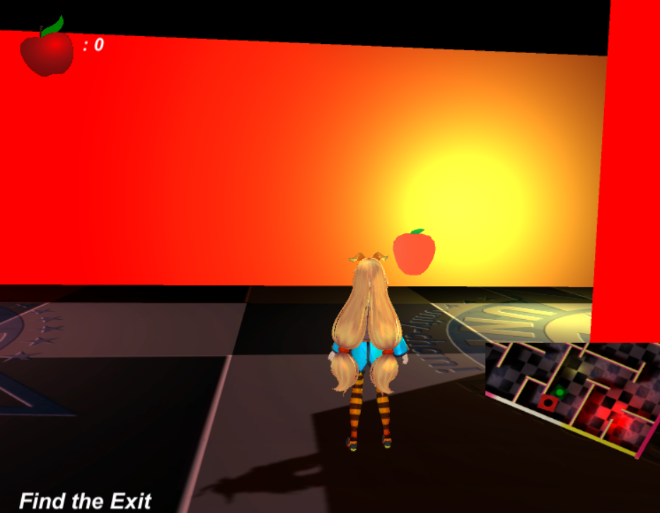

# lab_unity-chan

Dos retos se han presentado a Unity-chan, ayudala a superarlos.

Un pequeño videojuego hecho con Unity3D que consiste en dos niveles o retos para el personaje Unity-chan.

Primer reto. Unity-chan se encuentra dentro de un laberito, necesita encontrar el Green y lograr salir. Además, a lo largo del camino hay manzanas, "¡a comer!".

Segundo reto. Un conjunto de bloques flotando en medio de la nada, Unity-chan debe llegar al Green, "¡cuidado, puedes caer!".

